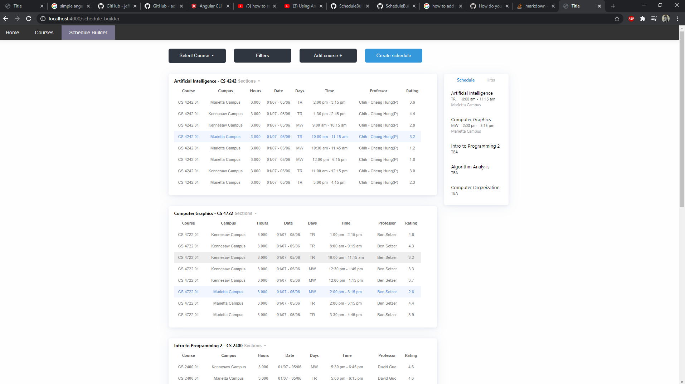

# README

This project is an application that allows students to easily access and create their university schedules. 
This application will provide features which includes: 

* Users ability to access university course database
* Intuitive design for creating schedules (features below)
* Generating a display for the users selected schedule (with times and days of the classes)



## To Run

```python
# python app.py
```

## TODO
* Creating a account for each user and saving their general information and created schedules
* Drop down menus for selecting the courses a user wishes to have in their schedule (this will be in the courses page), 
and sending that info the schedule builder page
* Filtering option included (filtering classes between selected times, days, campus, or rating)
* Having the user able to enter the rating for a specific section of a course (rating applies to the professor rating) 
and have it saved
* Having color specific dot next the to rating of a section (red dot will be for ratings 1 and below/green dots will be 
for 4 and above)
* Creating a visual schedule for when a user clicks a create schedule button (displaying their entire schedule for all 
days of the week)

## Completed
* Displaying selected classes in a table format completed
* Ability to navigate between courses in a side bar menu
* Ability to select the desired class completed
* Other tables(courses) availability updated when a user selects a class (which means when a user clicks a class, 
then that time availability is no longer available, and all classes with that time conflict are grayed out)
* When a table is grayed out then, if a user clicks on it, it will indicate which class has the conflicting time
* Filtering Options completed for days of the week

## Other potential features
* Option to see other students signed up for the class, within the site

